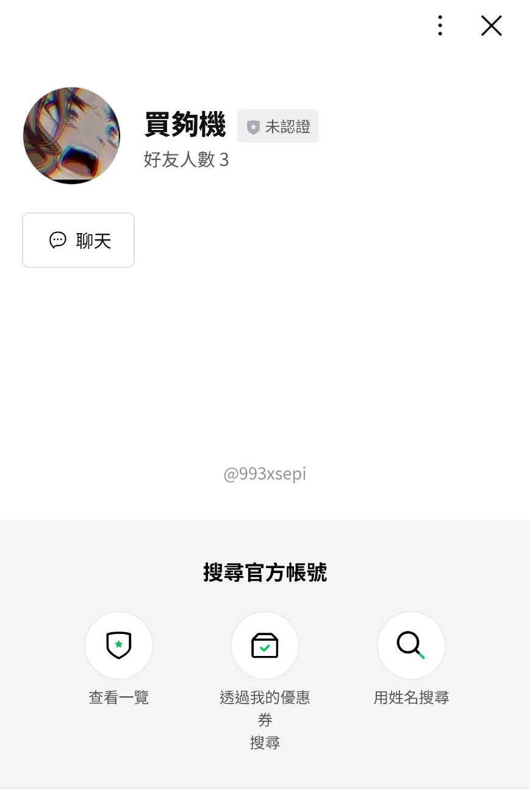
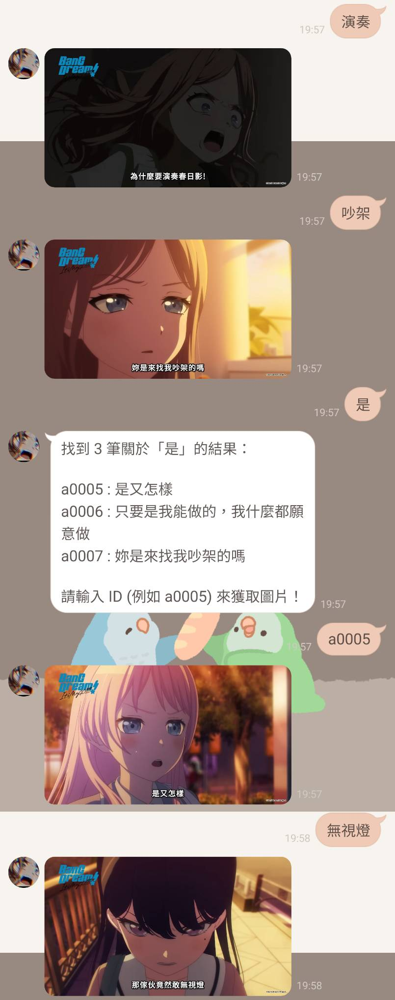
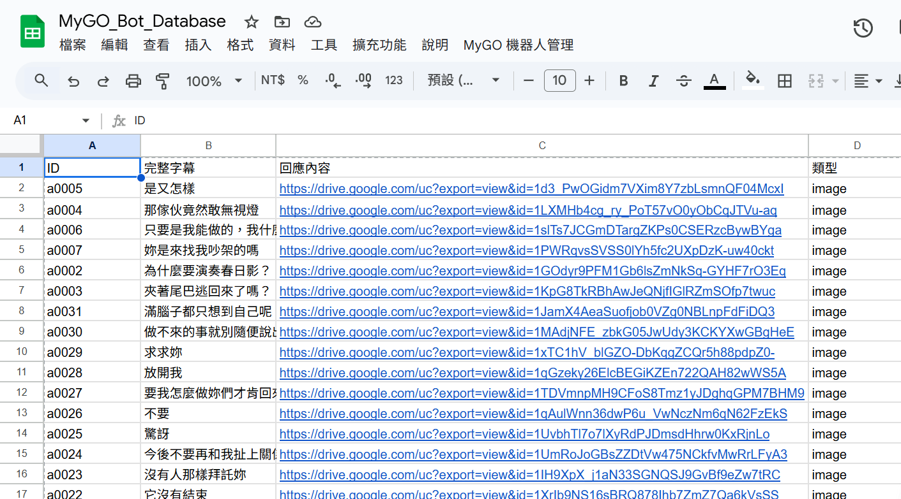

# MyGO Meme Bot (BanG Dream! It's MyGO!!!!! 截圖搜尋器)

-yellow)

## 🎸 專案緣起 (Intro)

> **「為什麼要演奏春日影！」**
> **"Why did you play Haruhikage?!"**

這是預計於 **2026 年正式推廣** 的 Side Project。
身為一個重度 MyGO 粉絲，我發現大家在群組聊天時，常常需要用到特定的截圖（例如爽世的沈重表情、燈的迷茫眼神）來進行「戰術性對話」。

為了讓大家能隨時隨地掏出梗圖，我開發了這個 **MyGO Meme Bot**。不需要存一堆圖在手機裡，只要輸入關鍵字，機器人就會從雲端資料庫把圖丟給你。

*(目前處於 Early Access 階段，尚未大規模宣傳)*

---

## 📲 立即試用 (Try it now)

歡迎加入 **MyGO 截圖搜尋器** 好友，開始體驗關鍵字找圖功能！

  

🔗 **好友連結**: [點擊這裡加入 LINE 官方帳號](https://line.me/R/ti/p/@123456)
*(或搜尋 ID: @你的ID)*

---

## 📸 功能展示 (Demo)

### 1. 關鍵字模糊搜尋
想找某個場景但忘記哪一集？輸入關鍵字（如：`春日影`, `一輩子`, `鬼屋`），機器人會列出相關的 ID 與字幕。

### 2. 自動化資料庫管理 (Admin Tools)
為了便於維護，我寫了一個綁定在 Google Sheets 上的腳本 (`sheet_admin.gs`)。
只要把截圖丟進 Google Drive 資料夾，按一下 Excel 上方的 **「MyGO 機器人管理」** 按鈕，所有的圖片連結與標籤就會自動同步到資料庫中，完全不需要手動 Key 資料。

---

## 🛠️ 技術架構 (Tech Stack)

考慮到這是一個個人興趣專案，我選擇了 **Serverless + Zero Cost** 的架構方案：

* **Google Apps Script (GAS)**:
    * `bot_main.gs`: 部署為 Web App，處理 LINE Webhook 的高併發請求。
    * `sheet_admin.gs`: 綁定於試算表的 Container-bound Script，提供 GUI 管理介面。
* **Google Sheets**:
    * 作為輕量化關聯式資料庫 (Relational Database)，儲存 `ID`, `Tags`, `ImageURL`。
* **Google Drive**:
    * 作為 CDN 圖床 (Image Hosting)。

### 運作流程
1.  **User** 輸入 "爽世" -> LINE Server。
2.  LINE Server 呼叫 **GAS Webhook**。
3.  GAS 快速掃描 **Google Sheet** 內容。
4.  GAS 回傳圖片 Direct Link -> **User**。

---

## 🚀 部署指南 (Setup)

如果你也想做一個自己的動漫梗圖機器人：

1.  **準備素材**：
    * 在 Google Drive 建立資料夾，將圖片命名為 `ID_關鍵字.jpg` (例如 `a001_為什麼要演奏春日影.jpg`)。
2.  **建立後台**：
    * 開一個新的 Google Sheet，將 `src/sheet_admin.gs` 的程式碼貼入「擴充功能 > Apps Script」。
    * 執行 `onOpen`，你的試算表就會出現同步按鈕。
3.  **連接 LINE Bot**：
    * 建立另外一個 GAS 專案貼入 `src/bot_main.gs`。
    * 部署為網頁應用程式 (Web App)，並將網址填入 LINE Developers Console 的 Webhook URL。
    * 把 Channel Access Token 填回程式碼中。

*It's MyGO!!!!!*

